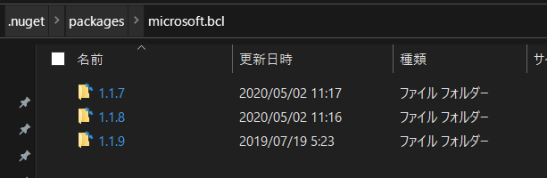
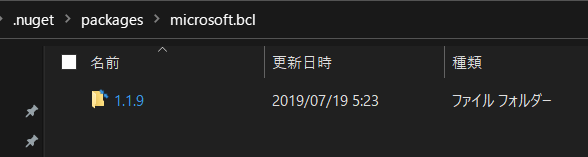

# rmnuget

This tool remove old NuGet Packages from local disk.

## How to use

```cmd
c:\>rmnuget
```

Before:





## Requirements

- .NET Core 3.1 supported OS

Note:  
I had tested Windows 10(1909/2004).

## How to build

1. Install .NET Core SDK 3.1
2. ```dotnet build -c Release ```
